# 3DRadSpace 0.1.0 Alpha release

Hello @everyone,

After a (very) long wait, 3DRadSpace 0.1.0Alpha is finally finished!

Compared 0.0.6Alpha, 0.1.0Alpha is a complete C++ rewrite, much more stable and usable than the previous version. It is an entirely new codebase, everything previous was removed.

The backend uses DirectX11 for rendering. It was the balance between simple and usable in terms of Graphics APIs. The engine is compiled for `x64_86`.

The main goal of this release is to implement NVidia PhysX bindings, and to have a minimally viable editor.

# Features and improvements
- Revamp of the editor to be more usable

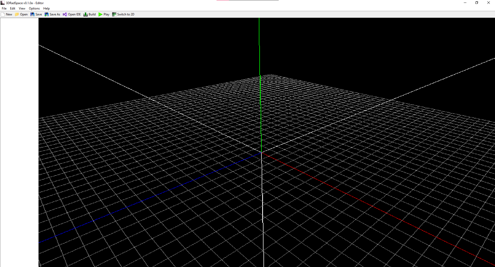

- User interfaces for object editing are generated from code, but custom interfaces can be made (Examples below are the C# Script and Skinmesh):
 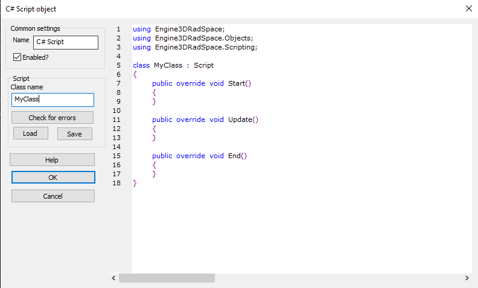
 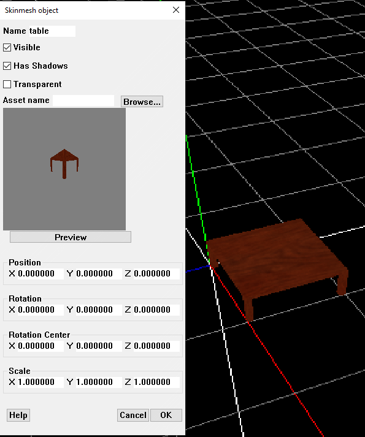

- Added Physics objects including
    - GForce (physics enabler)
    - Force
    - RigidStatic (static mesh collider)
    - RigidDynamic (compound dynamic mesh collider)
    - FPCharacter (general purpose character controller with an capsule collider)
    - Joint
    The physics implementation uses NVidia PhysX 5.5.0.
- Added objects that represent primitive geometric shapes (that use lambertian shading)
    - Box (can be used as a collider by being an child of an RigidDynamic)
    - Sphere (can be used as a collider by being an child of an RigidDynamic)
    - Cone
    - Cylinder
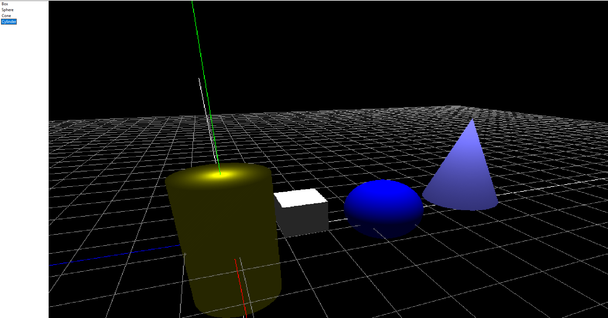
- Shadow mapping (using 3x3 PCF)
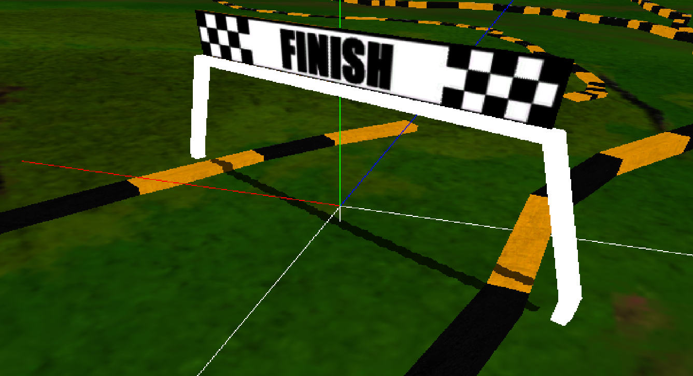
- Basic support for custom plugins and objects. Included plugins are:
    - Plugin for C# support
    - Plugin for AngelScript support
    - "Hello world" intro plugin
- DDS support for Skybox
- SpriteBillboard object (the tree is an SpriteBillboard object, and FreeCam is also shown)
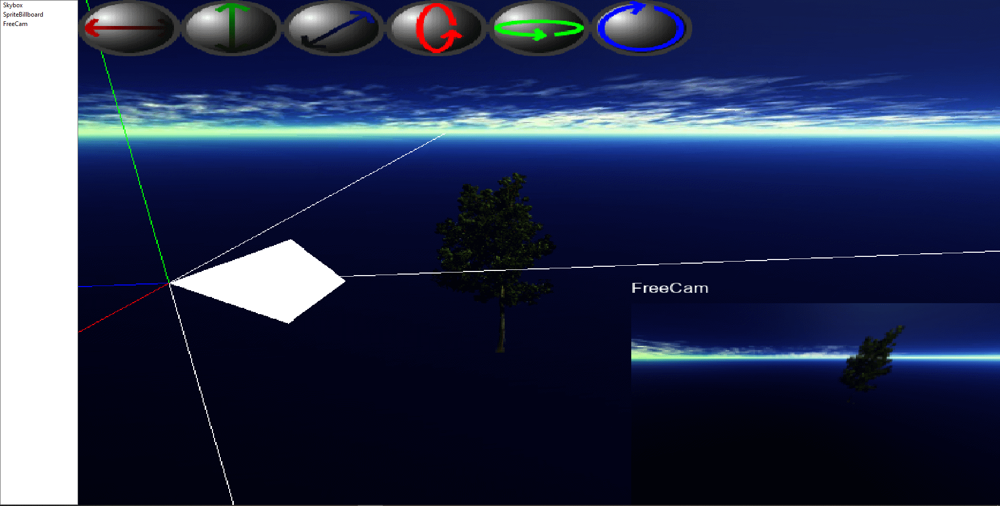
- FreeCam replaces FPVCamera from 0.0.6Alpha, and also introduces an 6 DoF camera
- Asset management using an dialog
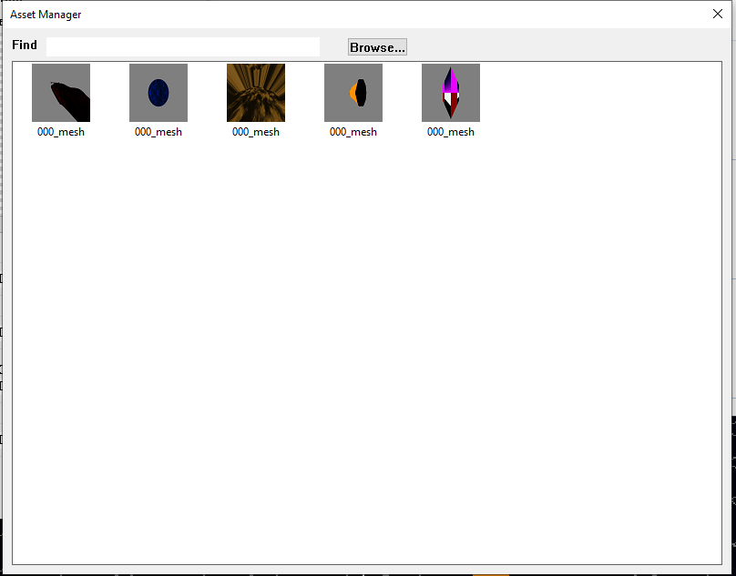
- "Prefer Arc Camera" to toggle an arc camera like in 3D Rad v722, or use an first person view camera to explore the scene
- Autoupdater works again
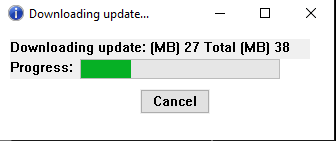
- Settings use JSON for passing and do not crash the editor if invalid
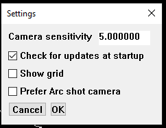
- Project format also uses JSON internally
- Events aren't hardcoded (like in 0.0.6Alpha, or 3D Rad v722), but they use reflection metadata to determine what can be done
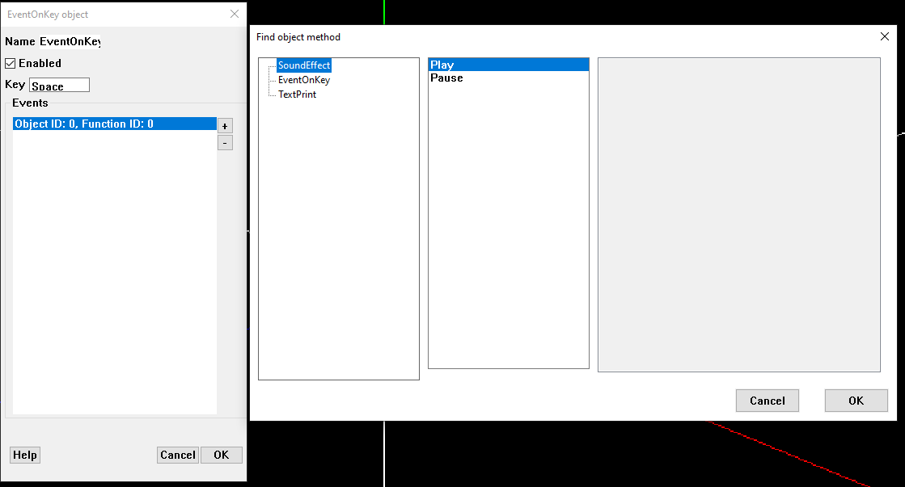
- 3DRadSpace.Player was replaced by an command line project compilier that generates Visual Studio C++ projects

# Visual Studio Plugin
A plugin for Visual Studio was written to make linking 3DRadSpace projects much easier. It features project templates in C++ (soon in C#), and file templates for user-written objects and plugins.
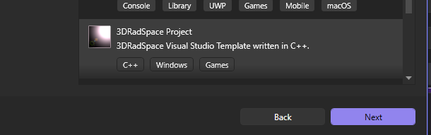

# Removed
- XNBConverter utilitary as Monogame is not used anymore
- Unused objects from 0.0.6Alpha, as they will be implemented in future releases
- 3DRadSpace.Player

Known issues:
- Memory leak in the EoK demo project
- Perspective aliasing on surfaces that are parallel enough with the light direction

Because this is an Alpha release, bugs are very likely, so please report them!

Thanks.